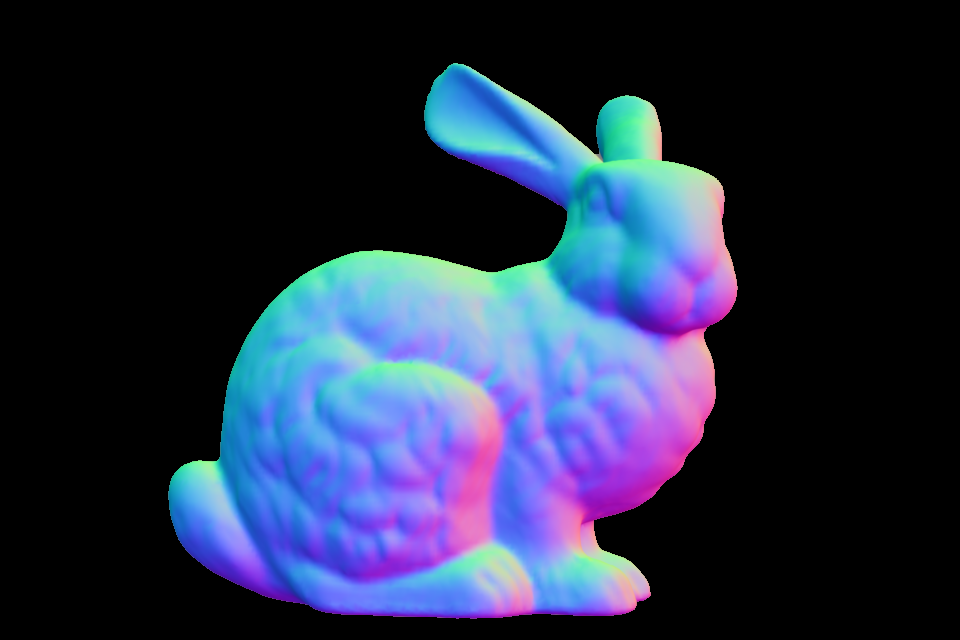

# Surface-from-Gradients: An Approach Based on Discrete Geometry Processing

## What is the DGP-SfP?
DGP-SfP is an efficient method to reconstruct surfaces from given normal maps.<br>
DGP is an abbreviation for Discrete Geometry Processing.<br>
SfP is an abbreviation for Surface-from-Gradients.<br>
DGP-SfP was first proposed in "Surface-from-Gradients: An Approach Based on Discrete Geometry Processing", W. Xie et al., CVPR 2014.

## How to use?
Clone the repository and run the main.py:
```
python main.py filename_of_normal_map
```

We have already prepared two normal maps for testing. They are put under /data. You can run:
```
python main.py data/bunny.png
python main.py data/scholar.png
```

As for the normal maps' formats, we support all the formats which could be read by OpenCV(e.g. png, jpg, bmp). **Notice** that the background of the normal map should be filled with pure black, (0, 0, 0).

## Dependencies
- OpenCV-Python
- NumPy
- SciPy
- scikit-learn


## Result

Normal map             |  Reconstructed surface 
:-------------------------:|:-------------------------:
  |  
  |  
